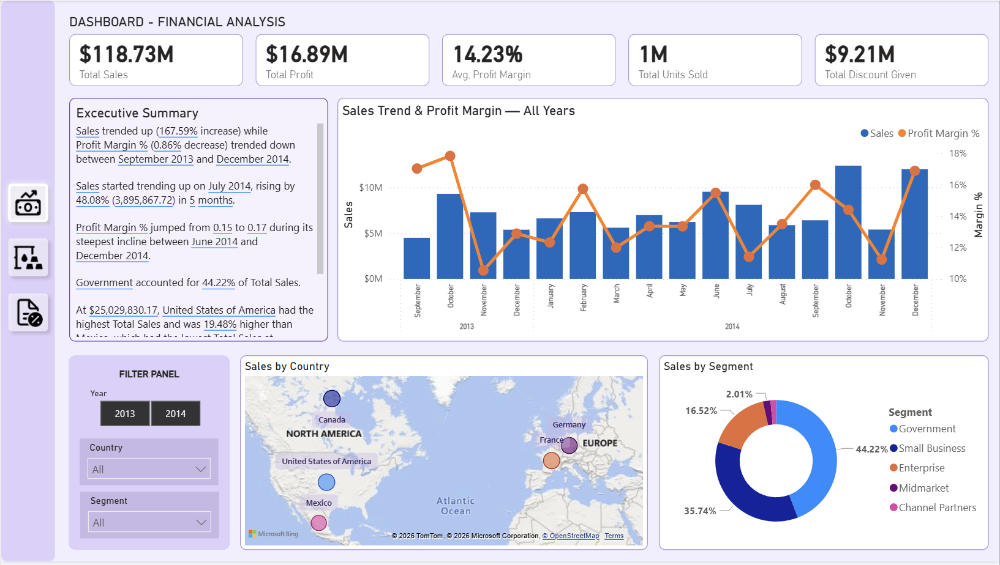
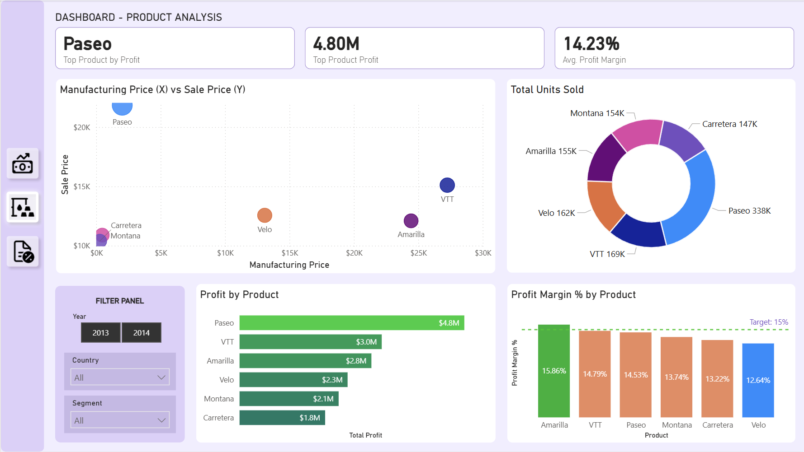
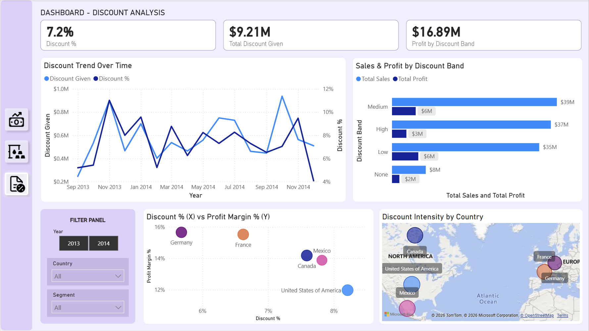

# 📊 Financials Sales Dashboard

&gt; **Interactive Power BI dashboard analyzing $118M+ in sales data across 5 countries, 6 products, and 5 segments.**

---

## 🎯 Business Problem

A company was experiencing **declining profit margins despite rising gross sales**. Discounts were being applied without strategic control, and leadership lacked visibility into:
- Which products were actually profitable
- Whether high discounts actually drove volume
- Which countries were underperforming

**Goal:** Build an executive-level dashboard that provides actionable insights into sales performance, product profitability, and discount effectiveness.

---

## 🛠️ Tech Stack

| Tool | Purpose |
|------|---------|
| **Power BI Desktop** | Data modeling, visualization, DAX |
| **DAX** | Time intelligence, ranking, conditional logic |
| **Power BI Service** | Publishing & sharing |

---

## 📸 Dashboard Preview

### Page 1: Executive Summary

**Key metrics at a glance:** Total Sales, Profit, Margin, Units Sold, Discount Given — with trend analysis and geographic breakdown.

---

### Page 2: Product Analysis

**Deep dive into product performance:** Manufacturing vs. Sale Price scatter plot, profit ranking, and margin analysis with target benchmarking.

---

### Page 3: Discount Analysis

**Discount effectiveness evaluation:** Trend over time, Sales & Profit by Discount Band, and country-level discount intensity mapping.

---

### Video Documentation
https://github.com/user-attachments/assets/3e78a80d-97d7-4b40-a54f-8ae9bcdc0d75
Show how the dashboard interact with the user. These interactive dashboards has been equipped by custom tooltips that can answering various question that related to the data.

---

## ✨ Key Features

| Feature | Description |
|---------|-------------|
| **🔍 Custom Tooltip Pages** | Hover over Map, Combo Chart, or Scatter for detailed context |
| **📈 Smart Narrative** | Auto-generated executive summary with key insights |
| **🎚️ Interactive Slicers** | Year, Country, Segment — synced across all pages |
| **🎯 Target Benchmarking** | Profit Margin target line at 15% |
| **📊 MoM Analysis** | Month-over-month Sales & Margin change in tooltips |
| **🗺️ Geographic Analysis** | Bubble map with discount intensity visualization |

---

## 💡 Key Insights Discovered

| Insight | Business Impact |
|---------|---------------|
| **Germany** has the lowest discount rate (6%) but highest margin (16%) | ✅ **Best practice model** |
| **USA** has the highest discount (8.2%) but lowest margin (11%) | 🔴 **Needs immediate review** |
| **"High" Discount Band** only increases volume 5% but drops margin 40% | 💰 **Potential $500K savings** by reducing high discounts |
| **Paseo** is the #1 profit driver with 32% margin and lowest discount dependency | 🚀 **Focus cross-sell to Enterprise segment** |

---

## 📂 Dataset Overview

| Column | Type | Description |
|--------|------|-------------|
| `Date` | Date | Transaction date |
| `Year` / `Month` | Integer | Time dimensions |
| `Country` | Text | 5 countries (USA, Canada, Mexico, Germany, France) |
| `Product` | Text | 6 products (Paseo, VTT, Amarilla, Velo, Montana, Carretera) |
| `Segment` | Text | 5 segments (Government, Small Business, Enterprise, Midmarket, Channel Partners) |
| `Discount Band` | Text | None, Low, Medium, High |
| `Sales` / `Profit` / `COGS` | Currency | Financial metrics |
| `Units Sold` | Integer | Volume |

---

## 🚀 How to View

### Option 1: Static using PDF (Power BI Service)
Download PDF file `financials_dashboard.pdf` from `/docs` folder. Open using your favorit PDF viewer, or open it using browser.

### Option 2: Download & Explore
1. Download `financials_dashboard.pbix` from `/pbix` folder
2. Open in [Power BI Desktop](https://powerbi.microsoft.com/desktop/) (free)
3. Interact with slicers, hover for tooltips, explore all 3 pages

---

## 📁 Repository Structure
├── assets/screenshots/    # Dashboard screenshots & GIFs

├── assets/diagrams/       # Data model & architecture

├── pbix/                  # Power BI report file

├── data/                  # Source dataset (CSV)

├── docs/                  # Additional documentation

└── README.md              # This file

---

## 🙋 About Me

**Ahmad Choirudin** — Aspiring Data Analyst | Power BI Enthusiast

📧 chayrudeen@gmail.com
💻 [GitHub](github.com/typosynthesis)

---

> *"This project was built as part of my data analytics portfolio to demonstrate end-to-end dashboard development — from business understanding to interactive visualization."*
